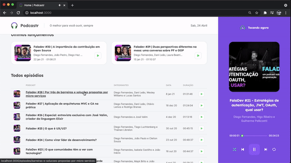
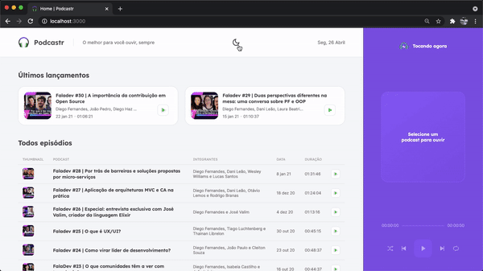

Podcastr is an application that allows users to listen to podcasts episodes and read detailed information about each one.

## 📸 Overview:




## 💻 Project:
• Pages are statically generated (SSG) and server-side rendered (SSR) using the Next.js framework. These features not only enhance the application's performance but also improve its SEO; <br /> <br />
• The application uses a fake API to fetch all podcast data, with requests handled by Axios; <br /> <br />
• Built with ReactJS, the project follows the SPA (Single Page Application) concept, where the header and player remain consistent on the page while the central content changes; <br /> <br />
• <strong>I extended the original application by adding responsiveness and a dark theme to the project.</strong> <br />

## 🚀 Technologies:
### ✔️ ReactJS
### ✔️ Next.js
### ✔️ TypeScript
### ✔️ React Hooks
### ✔️ SASS
### ✔️ Axios

# How to run

```
# Clone this repository
$ git clone https://github.com/keyyuwan/Podcastr

# Go to the directory
$ cd Podcastr

# Install Dependencies
$ yarn

# Run Web Server
$ yarn dev

# Run Server
$ yarn server
```
